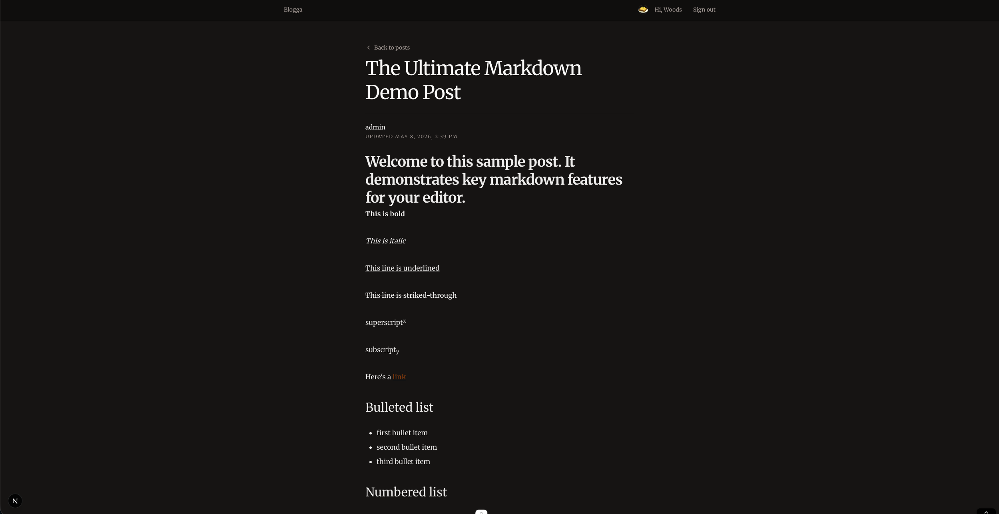

# Blog API



Blog site for [The Odin Project](https://www.theodinproject.com/).

[Source Repository](https://github.com/ChiefWoods/blog-api)

## Features

- View published posts
- Leave user comments
- Manage posts as an admin

## Built With

### Tech Stack

- [](https://nextjs.org/)
- [](https://www.prisma.io/)
- [](https://ui.shadcn.com/)
- [](https://vitest.dev)
- [](https://playwright.dev/)
- [](https://www.docker.com/)

## Getting Started

### Prerequisites

Update your Bun toolkit to the latest version.Respo

```bash
bun upgrade
```

### Setup

1. Clone the repository

```bash
git clone https://github.com/ChiefWoods/blog-api.git
```

2. Install all dependencies

```bash
bun install
```

3. Create env file

```bash
cp .env.example .env.development
```

4. Start local Postgres (dev)

```bash
bun run docker:db:up
```

5. Apply migrations

```bash
bun run db:migrate
```

6. Generate Prisma client

```bash
bun run db:generate
```

7. Start development server

```bash
bun run dev
```

8. Build project

```bash
bun run build
```

9. Preview build

```bash
bun run start
```

### Testing

1. Create env file

```bash
cp .env.example .env.test
```

2. Setup Playwright

```bash
bun run test:e2e:install
```

2. Start local Postgres (test)

```bash
bun run docker:test-db:up
```

3. Test project

```bash
bun run test:unit
bun run test:dom
bun run test:e2e
```

## Issues

View the [open issues](https://github.com/ChiefWoods/blog-api/issues) for a full list of proposed features and known bugs.

## Acknowledgements

### Resources

- [Shields.io](https://shields.io/)
- [Lucide](https://lucide.dev/)

## Contact

[chii.yuen@hotmail.com](mailto:chii.yuen@hotmail.com)
